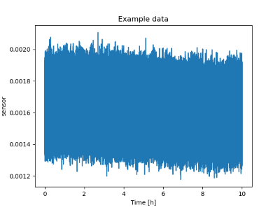
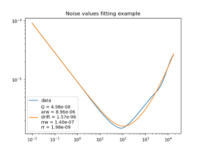

# Allan variance for accelerometer and gyroscopes

The objective is to use the same function to calculate noise levels from inertial sensors using the Allan variance.

## Inputs

- Accelerometer
 
    m/s $^2$ or $g$

- Gyroscopes

    $\degree$/h or $\degree$/s
  
The function will calculate the Allan  variance, preferably by using a library, and then plot the Allan deviation to fit the curve in order to obtain the noise values from the sensor.

## Outputs
The Allan deviation plot will be in the same unit as the input.

- Accelerometer
  
  Velocity random walk $(\sigma(1s))$ : $m/s^2/\sqrt{Hz}$ or $g/\sqrt{Hz}$
  
  Bias: m/s $^2$ or $g$

  <!-- Acceleration random walk:  -->
  

- Gyroscopes

  Angle random walk $(\sigma(1s))$ :

  Bias:

  Rate random walk:
  

# How to recover the noise values

Allan variance according to IEEE standard

from the Allan deviation plot, fit the lines with the given
slope and then replace the tau in the line to get the value.

Q [Unit $\cdot$ s $^{1} $]		→ slope -1 	at $\tau = \sqrt 3$

ARW	[Unit $\cdot$ s $^{1/2} $]	→ slope -1/2 	at $\tau = 1$

BIAS [Unit $\cdot$ s $^{0} $]	→ slope 0    	at $\tau \gg 1/f_{cutoff}$

RRW	[Unit $\cdot$ s $^{-1/2} $]	→ slope 1/2 	at $\tau = 3$

RR [Unit $\cdot$ s $^{-1} $]		→ slope 1 	at $\tau = \sqrt 2$

Markov  --> peak at $1.89 \tau / T_c$, where $T_c$ is correlation time and value of $0.437{\times}q_c {\times}\sqrt T_c$
obs: Markov correlated noise is used by Wheeler (2022) as the drift value.

## Fitting noises

Considering an Allan deviation in the classical form (without the decreasing part at the end) the noises values can be fitted with the implemented function `fit_allanvar()`, as shown by the `example.jl`.

